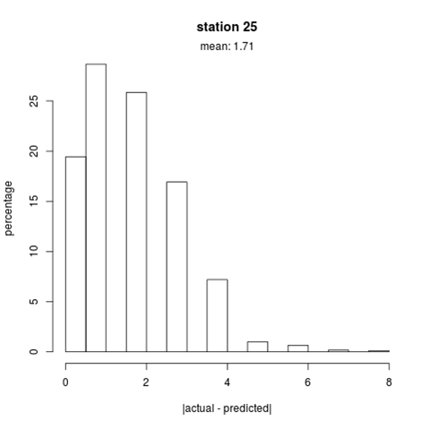

#1. Overview
##1.1 Motivation
Bike-sharing is a global trend that is here to stay and presents unique challenges in inventory management, including the need to forecast demand, optimally allocate bicycles across the system, transshipment optimization, among others. 

##1.2. Dataset
The data consisted of 700 bikes and 70 stations, across 5 districts in the San Francisco Area. The biggest table in the data set was one that was made out of over 70 million rows, which captured real-time bike availability per station for every minute for a period of 2 years.

The data was acquired from Bay Area Bike Share’s website, which can be accessed in the following link:
http://www.bayareabikeshare.com/open-data

##1.3 Objectives
- Understand the drivers of bike demand
- Develop models to predict bike availability in order to anticipate stock-outs

The predictive models developed could serve as part of a monitoring system that would trigger an alert, whenever the numbers of expected bikes fall below a specified threshold. Logistic regression was used to model the probability of bike availability, while a negative binomial model was used to predict the number of available bikes at a given time.

##1.4 Scope and Assumptions
- Considering that the cost of a stock-out during the weekday is higher than that during the weekend, the analysis was limited to weekdays.
- All bikes in the system are assumed to functional and transshipments have not been factored.

#2. Analysis
## Modeling the probability of bike availability

For the logistic regression model, four time-dependent clusters among the bike stations were identified using singular value decomposition and performing hierarchical clustering on the principal components **(Figure 1)**. These four clusters are visible in this heatmap and the paired relationships between outward and inward bike movement can be identified, suggesting the need to model each cluster separately.

As inputs, the model uses as inputs categorical variables representing hourly intervals,  months, day of the week, and weather. This last weather variable was constructed from the existing weather data to indicate 1= normal day, 2=foggy with little rain, and 3= rainy day. The outcome variable is binary where 1= number of available bikes < 6 and 0= number of available bikes >= 6. Six is equivalent to 25~30% of station fullness. Assuming that system operators have a target average fullness per station of 50%, setting initially the cut-off point at “6” seems a reasonable. 

The final model was selected after evaluating goodness-of-fit by comparing deviance and accounting for multicollinearity by using GVIF (General Variance Inflation Factor).

The model shows the significance of time between 6:00 and 20:00 as predictor of bike availability **(Figure 2)**. Furthermore, the first half of the year seems to be busier for the system than the second half. We can also observe that the probability of a stock-out drops during the month of September, suggesting a summer vacation effect. Although we were expecting higher bike availability during adverse weather conditions, we obtained mixed results, suggesting that users could be less sensitive to weather during the weekday or that when it does rain, its intensity and frequency throughout the day is not uniform.

Initially, the training set was used to assess the model by computing the AUC **(Figure 3)** and accuracy rate **(Figure 4)**, where the latter was compared with 2 naïve benchmarks. The first naive benchmark forecasts the number of bikes available at time T to be equal to T – 1 hour, while the second one uses a 24 hour lag.

Even by using the training set, the model is not able to beat the naïve benchmark. However, the results indicate that the model could be useful for forecasting long-term availability. Furthermore, the model also suggests that including a time-lagged variable or doing a time-series analysis could substantially improve predictions.

## Modeling the number of available bikes
A negative binomial model was used to predict the number of bikes available as a function of time and weather. For model selection, 5-fold cross validation was used **(Figure 5)**.  

The following plots are a sample of the most representative results made for each bike station **(Figure 6-13)**. The blue dots represent actual number of bikes, the red dots represent the predicted number of bikes, and the dotted vertical line makes the separation between training and test set.

